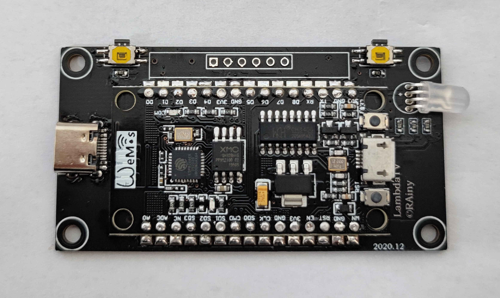
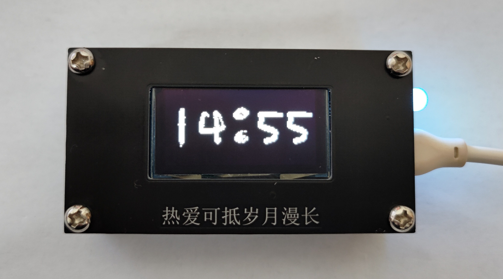
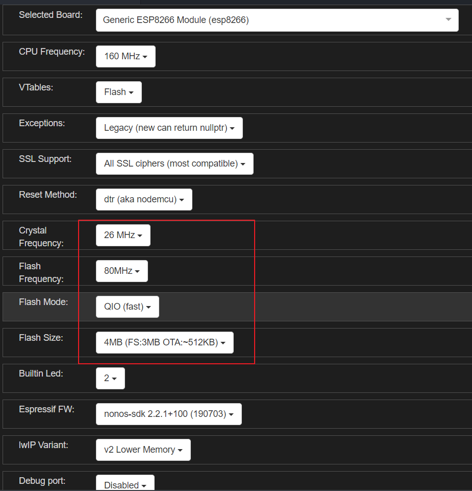
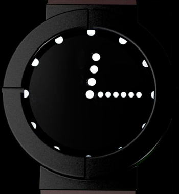
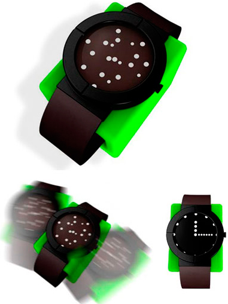
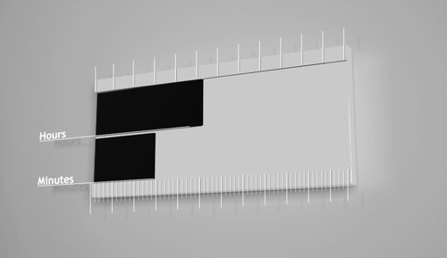
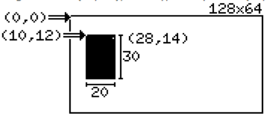

# LambdaTV

## 介绍

### 前言

ESP8266 是一块非常有意思的芯片，并且NodeMCU，CH340串口+32M Flash（兼容W25Q32），在淘宝上只需要不到十块钱，非常便宜，自带WIFI和可编程IO，网上有太多基于此开发的电子产品,比如[发明控](https://space.bilibili.com/14010836?from=search&seid=8620579619859114518)，网上教程也有很多,比如[太极创客](http://www.taichi-maker.com/homepage/esp8266-nodemcu-iot/iot-c/esp8266-nodemcu-web-server/web-server/)。在毕业来临之际，想做点东西送给小伙伴们，因此就有了此项目。PS：嘉立创，YYDS。PPS：开源，YYDS。

### 成品





四个功能 Clock Player Web Config

Clock--6种时钟模式,WiFi时钟

Player--5个小动画，最长的是BadApple

Web--局域网Http服务器，Web网址以二维码的形式显示

Config--设置，包括设置时钟模式，清除WiFi信息、操作说明等

B站演示视频：https://www.bilibili.com/video/BV1K5411A7eh/

### 操作说明

单击C 下一步

双击C 上一步

单击S 确认 长按S 退出

### 部分清单

所涉及的元器件不多，有[NodeMCU](https://item.taobao.com/item.htm?spm=a1z10.3-c-s.w4002-21223910208.37.26426a4bO4skWi&id=629263288633)、[1,3吋OLED](https://item.taobao.com/item.htm?spm=a230r.1.14.47.1a997dda6rxNmb&id=21979047888&ns=1&abbucket=20#detail)、[轻触开关](https://item.taobao.com/item.htm?spm=a1z10.3-c-s.w4002-21223910208.77.7bf86a4btvzQPL&id=546747577238)、[三脚直插RGB](https://item.taobao.com/item.htm?spm=a1z10.3-c-s.w4002-21223910208.14.5e156a4bVyftsz&id=544549973880)、[Type-C母座](https://item.taobao.com/item.htm?spm=a1z10.3-c-s.w4002-21223910208.13.403f6a4bsDOedE&id=573090887123)、1K电阻，[螺柱(M3\*9+6单头、M3\*6+6单头、双通M3\*9)](https://item.taobao.com/item.htm?spm=a1z10.3-c-s.w4002-14471674935.19.10e43e2biLvKHk&id=534616257622)。

**PS：用这个OLED是因为之前有库存，建议后面换成中景园的OLED，便宜一半的价格，记得改一下PCB的引脚，修改一下代码就可以。**

## 开发环境

ESP8266 （基于NodeMCU）+ 16M Flash （自己更换的）+ 1.3`OLED(SH1106)

Ardunio IDE

VsCode + Ardunio 插件

Ardunio RULs：http://arduino.esp8266.com/stable/package_esp8266com_index.json

Ardunio 库：[U8g2](https://github.com/olikraus/u8g2/wiki/u8g2reference)、OneButton、Ticker、[WiFiManager中文版本](https://github.com/taichi-maker/WiFiManager)、NTPClient、Time-master、QRCode、WiFiSTA

螺柱：M3*6+6

Gif和视频来自网络，侵删！

**因为对U8g2的库进行了一些添加和修改，故将所使用的libraries打包压缩，放进来，路径是C:\Users\Win10\Documents\Arduino\。**

### Ardunio编译过慢

[Arduino IDE首次编译很慢?](https://www.zhihu.com/question/29961352)

[在vscode中开发arduino编译巨慢解决办法](https://blog.csdn.net/cxgasd/article/details/90597496)

vscode安装Ardunio 插件，实际还是使用Ardunio 编译，但编译过程太漫长了，一次差不多要大几分钟，实在是受不了了。

#### 原因

引用*[WeberVon Won](https://www.zhihu.com/people/john-wong-35-27)*的回答。

Arduino IDE是后台调用AVR-GCC来编译的。IDE在每次启动后的首次编译中，都会将基本库中所有的.c文件编译为.o文件，这需要挺长一段时间。而之后的编译，仅仅将有修改的.c文件重新编译，速度就快多了。由于编译产生的目标文件都是放在临时文件夹中的，且IDE每次重新启动后所使用的临时文件夹名称都不同，故每次启动IDE后的首次编译，都需要重新编译一次基本库中所有的.c文件。


#### 解决方法

只需在**.vscode -> arduino.json**文件中将输出目录 output 配置一下就可以大大提高二次下载的编译速度。

`  "output": "./build"`


SPIFFS上传文件太慢就无解了。

### VsCode输出乱码


将Ardunio语言设置为英文。


## 配置及引脚

ESP8266 开发板引脚：


==**MATTERS NEEDING ATTENTION**
On every boot/reset/wakeup,
GPIO15 MUST keep LOW, GPIO2 MUST keep HIGH.
GPIO0 HIGH ->RUN MODE, LOW -> FLASH MODE.
When you need to use the sleep mode,GPIO16 and RST should be connected,
and GPIO16 will output LOW to reset the system at the time of wakeup.==

IO口与序号相对应的（选择Board信息不同，D1所代表的引脚不一样，需要找到对应的引脚序号）：


四线SPI OLED：CLK——D5（GPIO14），MOSI——D7（GPIO13），CS——D4（GPIO2）(板子上LED也连在D4)，D/C——D2（GPIO4）

按键：D3（GPIO0——S） D1（GPIO5——C）

RGB_LED：R——TX（GPIO1），G——RX（GPIO3），B——D6（GPIO12）【IO太少了，还占用调试串口】

### PWM引脚

```c
//总共可用  0-15 16皆可IO pwm 输出 但是 6-11被系统时钟占用
//实际可用  0 1（TX） 2 3(RX) 4 5 12 13 14 15 16
```

#### [Analog output](https://arduino-esp8266.readthedocs.io/en/latest/reference.html#analog-output)

**NOTE:** The default `analogWrite` range was 1023 in releases before 3.0, but this lead to incompatibility with external libraries which depended on the Arduino core default of 256. Existing applications which rely on the prior 1023 value may add a call to `analogWriteRange(1023)` to their `setup()` routine to return to their old behavior. Applications which already were calling `analogWriteRange` need no change.

==The ESP doesn’t have hardware PWM==, so the implementation is by software. With one PWM output at 40KHz, the CPU is already rather loaded. The more PWM outputs used, and the higher their frequency, the closer you get to the CPU limits, and the fewer CPU cycles are available for sketch execution.

## Ardunio ESP8266板子信息配置

**16MB Flash NodeMCU配置**


**默认4MB Flash NodeMCU配置**



## BadApple

### U8g2驱动OLED

OLED 显示库使用的是[u8g2](https://github.com/olikraus/u8g2/wiki/u8g2setupcpp)。

u8g2 SPI 接口(用的是硬件SPI)：

```c
U8G2_SH1106_128X64_NONAME_F_4W_HW_SPI u8g2(U8G2_R0, /* cs=*/ 2, /* dc=*/4 );
```

其中SH1106 硬件SPI接口如下：

```C
U8G2_SH1106_128X64_NONAME_1_4W_HW_SPI(rotation, cs, dc [, reset]) [page buffer, size = 128 bytes]
U8G2_SH1106_128X64_NONAME_2_4W_HW_SPI(rotation, cs, dc [, reset]) [page buffer, size = 256 bytes]
U8G2_SH1106_128X64_NONAME_F_4W_HW_SPI(rotation, cs, dc [, reset]) [full framebuffer, size = 1024 bytes]
```

在[深入学习Arduino u8g2 OLED库，一篇就够](https://blog.csdn.net/dpjcn1990/article/details/92831760)博客中有很详细的介绍，以下是对U8g2绘制模式的摘抄。

#### U8g2绘制模式

U8g2支持三种绘制模式：

* Full screen buffer mode，全屏缓存模式
* Page mode (This is the U8glib picture loop) 分页模式
* U8x8, character only mode 仅仅支持普通字符

##### Full screen buffer mode

特点：

* 绘制速度快
* 所有的绘制方法都可以使用
* 需要大量的ram空间

构造器：

构造器必须带有F，比如：

```c
U8G2_SH1106_128X64_NONAME_F_4W_HW_SPI u8g2(U8G2_R0, /* cs=*/ 2, /* dc=*/4 );
```

用法：

1. 清除缓冲区 u8g2.clearBuffer()
2. 操作一些绘制方法
3. 发送缓冲区的内容到显示器 u8g2.sendBuffer().

示例代码：

```c
void setup(void) {
  u8g2.begin();
}

void loop(void) {
  u8g2.clearBuffer();
  u8g2.setFont(u8g2_font_ncenB14_tr);
  u8g2.drawStr(0,20,"Hello World!");
  u8g2.sendBuffer();
}
```

#### Page mode

特点：

* 绘制速度慢
* 所有的绘制方法都可以使用
* 需要少量的ram空间

构造器：

构造器必须带有“1”或者2，比如：

```c
U8G2_SH1106_128X64_NONAME_1_4W_HW_SPI u8g2(U8G2_R0, /* cs=*/ 2, /* dc=*/4 );
```

用法：

1. 调用 u8g2.firstPage()
2. 开始一个 do while 循环
3. 在循环内部 操作一些绘制方法
4. 不断判断 u8g2.nextPage()

示例代码：

```c
void setup(void) {
  u8g2.begin();
}

void loop(void) {
  u8g2.firstPage();
  do {
    u8g2.setFont(u8g2_font_ncenB14_tr);
    u8g2.drawStr(0,24,"Hello World!");
  } while ( u8g2.nextPage() );
}
```

#### U8x8 character mode

特点：

* 绘制速度快
* **并不是对所有的显示器都有效**
* 图形绘制不可用
* 不需要ram空间

构造器：

使用U8X8构造器，比如：

```c
U8X8_ST7565_EA_DOGM128_4W_SW_SPI(clock, data, cs, dc [, reset])
```

示例代码：

```c
void setup(void) {
  u8x8.begin();
}

void loop(void) {
  u8x8.setFont(u8x8_font_chroma48medium8_r);
  u8x8.drawString(0,1,"Hello World!");
}
```

### U8g2显示图片

#### API

```c
/**
 * 绘制图像
 * @param x 左上角坐标x
 * @param y 左上角坐标y
 * @param w 图形宽度
 * @param h 图形高度
 * @param bitmap 图形内容
 * @Note 关联方法 setBitmapMode
 */
void U8G2::drawXBM(u8g2_uint_t x, u8g2_uint_t y, u8g2_uint_t w, u8g2_uint_t h, const uint8_t *bitmap)
void U8G2::drawXBMP(u8g2_uint_t x, u8g2_uint_t y, u8g2_uint_t w, u8g2_uint_t h, const uint8_t *bitmap) 
```

**drawXBM和drawXBMP区别在于 XBMP支持PROGMEM**

[Arduino - 利用PROGMEM将数据写到闪存（程序存储空间)](https://blog.csdn.net/sdlgq/article/details/88720706)

**定义全局常量时，使用 PROGMEM 关键字，或使用 PROGMEM 数据类型，告诉编译器 “ 把这个信息存到程序存储空间 ”，而不是存到“ 动态内存 ”。**

#### 显示xbm图片

`U8G2::drawXBM`是显示xbm格式图片，打开xbm图片，其内容如下：


其中数组里面定义的就跟图片取模生成的数组一样的。

显示代码如下：

```c
uint8_t rook_bitmap[1024] U8X8_PROGMEM ={};

u8g2.clearBuffer();
u8g2.drawXBM(0,0,128,64, rook_bitmap);
u8g2.sendBuffer();
```

### U8g2显示动画

调用`u8g2.drawXBM`一直显示图片就可以，问题在需要将视频转化为一段连续的xbm图片。

#### ffmpge

用ffmpge将视频每一帧图片提取出来：

```shell
ffmpeg -i ./BadApple.flv -r 15 -s 128x64 -f image2 ./temp/%d.xbm
```

```
-r 表示帧率
-s 表示分辨率
```

==处理出来的xbm图片，显示出来是反的，意思是之前白的显示黑色的，黑色的显示白色的。==

#### 图片动画显示

得到了一连串的xbm（分辨率128X64）图片，只需要将里面的信息读取出来显示到OLED中。

一开始取的5帧，得到的xbm总共1087张，大小为7.85M。使用ESP8266的文件系统，SPIFFS。通过Ardunio IDE上传所有的xbm图片（没办法，Flash大，**:laughing:**），不会上传的可以参考太极创客的教程，[3-3-2 通过Arduino IDE向闪存文件系统上传文件](http://www.taichi-maker.com/homepage/esp8266-nodemcu-iot/iot-c/spiffs/upload-files/)。只想说16M的Flash上传擦除也需要太久了吧。

**思路**：

遍历每个xmb(xmb命名是从1到1098)，读取（判断）0x（这里是文件，0x是两个字符串）后面的两个字符串，最后将两个字符串合并为uint8_t的数据（0x00, 0x00, 0xF8, 0x3F, 0x00）。

```c
uint8_t ascii_to_uint8_t(char str)
{
  uint8_t res=0;
  if(str >= '0' && str <= '9')
  {
    res=str-'0';
  }
  else if(str >= 'A' && str <= 'F')
  {
    res=str-'A'+10;
  }
  else if(str >= 'a' && str <= 'f')
  {
    res=str-'a'+10;
  }
  return res;
}

void loop(void) 
{
  char data_read;
  static int data_len=0;
  static uint8_t start_flag=0;
  uint8_t data_temp[2]={0};
  for(int xbm_num=0;xbm_num<1098;xbm_num++)
  {
    sprintf(file_name_buff,"/%d.xbm",xbm_num);
    String file_name=file_name_buff;
    //确认闪存中是否有file_name文件
//       if (SPIFFS.exists(file_name)){
//         Serial.print(file_name);
//         Serial.println(" FOUND.");
//       } 
//       else {
//         Serial.print(file_name);
//         Serial.print(" NOT FOUND.");
//       }
    //建立File对象用于从SPIFFS中读取文件
    File dataFile = SPIFFS.open(file_name, "r"); 
    for(int i=0; i<dataFile.size(); i++){
      data_read=(char)dataFile.read();
      // Serial.print(data_read);
      if(data_read=='0'&&start_flag==0)
      {
        start_flag=1;
      }
      else if(data_read=='x'&&start_flag==1)
      {
        start_flag=2;
      }
      else if(start_flag==2)//这里是数据
      {
        data_temp[0]=ascii_to_uint8_t(data_read);
        start_flag=3;
      }
      else if(start_flag==3)
      {
        data_temp[1]=ascii_to_uint8_t(data_read);
        rook_bitmap[data_len]=0xff-((data_temp[0] << 4)|data_temp[1]);
        // Serial.println(rook_bitmap[data_len],HEX);
        data_len+=1;
        start_flag=0;
      }
      else
      {
        start_flag=0;  
      }
    }
    //完成文件读取后关闭文件
    dataFile.close(); 
    data_len=0;
    start_flag=0;  
    u8g2.clearBuffer();
    u8g2.drawXBM(0,0,128,64, rook_bitmap);
    u8g2.sendBuffer();
  }
}
```

至此图片能动起来，虽然很慢。

#### 优化

以上存在如下缺点：

* 所有的xbm文件太大了，一个128X64xbm文件就7kb，视频取5帧就有1089张，总共大小为7.85M，太大了。
* 遍历很费时间，遍历过程中还需要去解析，速度更慢了。
* U8g2用`U8G2_SH1106_128X64_NONAME_1_4W_HW_SPI u8g2(U8G2_R0, /* cs=*/ 2, /* dc=*/4 );`构造函数，显示太慢了。

解决方案：

1. 用python提前处理好图片，取出xbm数组里面的值，写入到bin文件中，最后得到的bin文件上传到SPIFFS，显示的时候直接两个循环将读取bin文件的数值放到数组里面去显示，形成动画效果。
2. U8g2用`U8G2_SH1106_128X64_NONAME_F_4W_HW_SPI u8g2(U8G2_R0, /* cs=*/ 2, /* dc=*/4 );`构造函数，SPI二分频，ESP8288主频设置到160M。

python处理一个xbm图片代码：

```python
import os
import struct

xbm_data = open('40.xbm').read()
# print(xbm_data)
prease_flag=0

for xbm in xbm_data:
    if xbm == 'x' and prease_flag == 0:
        prease_flag=1
    elif prease_flag == 1:
        str_to_hex=xbm
        prease_flag=2
    elif prease_flag == 2:
        str_to_hex+=xbm
        with open(os.path.abspath('.')+'/apple.bin','ab+') as f_bin: #打开二进制文件(追加完成)
            data_write=struct.pack('B',int(str_to_hex,16))
            f_bin.write(data_write)
        prease_flag=0
f_bin.close()
```

python处理所有的xbm图片代码：

```python
import os
import struct

prease_flag=0
file_num=1
filePath=r'./data_xbm' # 文件夹路径
fileList=os.listdir(filePath)# os.listdir(file)会历遍文件夹内的文件并返回一个列表
for file in fileList:
    file_name="./data_xbm/"+str(file_num) +'.xbm'
    print(file_name)
    f_xbm = open(file_name)
    xbm_data=f_xbm.read()
    for xbm in xbm_data:
        if xbm == 'x' and prease_flag == 0:
            prease_flag=1
        elif prease_flag == 1:
            str_to_hex=xbm
            prease_flag=2
        elif prease_flag == 2:
            str_to_hex+=xbm
            with open(os.path.abspath('.')+'/apple.bin','ab+') as f_bin: #打开二进制文件(追加完成)
                data_write=struct.pack('B',int(str_to_hex,16)) # B : unsigned char
                f_bin.write(data_write)
            prease_flag=0
    f_xbm.close()
    f_bin.close()
    file_num+=1
```

ESP8266显示代码：

```c++
void bad_apple(void)
{
  char data_read;
  static int data_len=0;
  //建立File对象用于从SPIFFS中读取文件
  String file_name="/apple.bin";
  dataFile = SPIFFS.open(file_name, "r"); 
  //确认闪存中是否有file_name文件
  if (SPIFFS.exists(file_name))
  {
    Serial.print(file_name);
    Serial.println(" FOUND.");
    Serial.println(dataFile.size());
  } 
  else 
  {
    Serial.print(file_name);
    Serial.print(" NOT FOUND.");
  }
  // dataFile.readBytes
  for(uint64_t xbm_num=0;xbm_num<dataFile.size();xbm_num++)
  {
    data_read=(char)dataFile.read();
    rook_bitmap[data_len++]=data_read;
    if(data_len==1024)
    {
      u8g2.clearBuffer();
      u8g2.drawXBM(0,0,128,64, rook_bitmap);
      u8g2.sendBuffer();
      data_len=0;
    }
  }
  //完成文件读取后关闭文件
  dataFile.close(); 
  delay(10);//可以延时一下
}
```

 ffmpge处理图片为15帧，最后得到的xbm总文件大小为20.3M，bin文件大小为3.29M。

*不延时3029张一共用时107S，差不多FPS=30.7*。

#### Gif分解

这个网站分解Gif为PNG，[ezgif](https://ezgif.com/split)。

## 按键

### 按键中断

唯一需要注意的是：中断回调函数

```c
const byte interruptPin = 0;  // 13 对应板载LED   2 对应433中断0
volatile byte interruptCounter = 0;
int numberOfInterrupts = 0;
  
void setup() {
  Serial.begin(115200);
  pinMode(interruptPin, INPUT_PULLUP);
  attachInterrupt(digitalPinToInterrupt(interruptPin), handleInterrupt, FALLING);
  
}
  
ICACHE_RAM_ATTR void handleInterrupt() {
  interruptCounter++;
}
  
void loop() {
  if(interruptCounter>0){
      interruptCounter--;
      numberOfInterrupts++;
      Serial.print("An interrupt has occurred. Total: ");
      Serial.println(numberOfInterrupts);
  }
}
```


Interrupt callback functions must be in IRAM, because the flash may be in the middle of other operations when they occur. Do this by adding the `ICACHE_RAM_ATTR` attribute on the function definition. If this attribute is not present, the sketch will crash when it attempts to `attachInterrupt` with an error message.

中断回调函数必须位于IRAM中，因为闪存在它们发生时可能处于其他操作的中间。 为此，可以在函数定义上添加ICACHE_RAM_ATTR属性。 如果不存在此属性，则草图会在尝试附加一条错误消息的attachInterrupt时崩溃。

[ESP8266 Arduino Core](https://arduino-esp8266.readthedocs.io/en/latest/reference.html#interrupts)

### 用Ticker定时器扫描按键

[Ticker](https://arduino-esp8266.readthedocs.io/en/latest/libraries.html#ticker)

[ESP8266多任务处理 – Ticker库使用说明](http://www.taichi-maker.com/homepage/esp8266-nodemcu-iot/iot-c/esp8266-tips/ticker/)

使用OneButton按键扫描库。

## 网络时间

[esp笔记（6）esp8266 获取 NTP 实时时间](https://blog.csdn.net/qq_17351161/article/details/90551624)

### NTP服务

NTP是网络时间协议(Network Time Protocol)，它是用来同步网络中各个计算机的时间的协议。ESP8266可以通过建立与NTP服务的连接，来获取实时时间。

### 校准时区

由于全球的时间是不同的，所以需要校准时间，以北京时间为例，在创建实例的时候，见校准参数传入即可。

```c
NTPClient timeClient(ntpUDP, "ntp1.aliyun.com",60*60*8, 30*60*1000);
```

### 获取时间

setup里面开始连接。

```c
timeClient.begin();
```

### 更新时间

```c
timeClient.update();
```

### 解析时间

```c
unsigned long unix_epoch = timeClient.getEpochTime();  
time_minu=minute(unix_epoch);      // get minutes (0 - 59)
time_hour=hour(unix_epoch);        // get hours   (0 - 23)
```

`timeClient.getEpochTime(); `得到的是Unix时间戳，需要转换为本地时间，使用的是TimeLib库，但TimeLib解析时间的结构体对应年的定义是用的`uint8_t`,应修改为`int`。

[C实现Unix时间戳和本地时间转化](https://blog.csdn.net/mill_li/article/details/54599927)

### 显示时间

#### 字体

如果用平常的字体就没有意思了，所以想着用手写字体，且每次更新时间的时候，数字进行手写更新动画。


#### 时间格式

只显示时和分，格式如上。屏幕大小是128\*64，那么一共显示五张图片，每张的长度为25，高度在64以内都可以。用PS制作0~9大小为25\*64的图片，高度在裁剪。


#### 动画效果

每个数字制作10张数字动画，用画笔工具将完整的数字进行擦除部分，得到10张合并起来反映就是数字写出来的动画效果。


在将这10张bmp图片转为xmb格式，最后用python处理为bin文件。0~9一共得到10个bin文件。反映动画跟上面播放BadApple的程序是一样的，读取bin文件，再去显示xbm图片。

#### 刷新指定区域显示

获取时间后OLED显示时间，分为5个部分，需要动画的话就需要局部刷新，全部刷新函数写起来来麻烦了。因为不是一直需要去显示数字写出来那个动画，只是更新时间才会去显示。

U8g2刷新指定区域显示的函数：

`void U8G2::updateDisplayArea(uint8_t  tx, uint8_t ty, uint8_t tw, uint8_t th)`

**Description:** Updates all or the specified rectangle area of the display. The member `updateDisplay()` function is almost identical to `sendBuffer()`. Member function `updateDisplayArea()` will update the specified rectangle area: Only the specified area is copied from the internal buffer to the display. The area has to be specified in tiles. One tile is a 8x8 pixel area. To get the pixel value, multiply the tile value with 8 (for `U8G2_R0`). The tile coordinates are independent from the applied rotation in the U8g2 constructor but have the same orientation as `U8G2_R0`. For other rotations the calculation between pixel value tile position is more complicated. The three member functions `sendBuffer`, `updateDisplay` and `updateDisplayArea` are designed for the full buffer mode (constructor with `_F_` in the name). However `sendBuffer` and `updateDisplay` can be used in page mode also. If `updateDisplay` is used together with ePaper displays, ensure that a proper refresh sequence is send to the display. Differences between `sendBuffer`, `updateDisplay` and `updateDisplayArea`:

| Behavior/Feature               | `sendBuffer` | `updateDisplay` | `updateDisplayArea` |
| ------------------------------ | ------------ | --------------- | ------------------- |
| Sends a refreshDisplay message | yes          | no              | no                  |
| Works in full buffer mode      | yes          | yes             | yes                 |
| Works in page buffer mode      | yes          | yes             | no                  |

**一个图块是8x8像素区域。要获得像素值，请将图块值乘以8（对于U8G2_R0）。**

对应的Demo是：**UpdateArea.ino**

刷新区域是显示区域的坐标和高度X8

```c
//显示区域
const uint8_t tile_area_x_pos = 2;	// Update area left position (in tiles)
const uint8_t tile_area_y_pos = 3;	// Update area upper position (distance from top in tiles)
const uint8_t tile_area_width = 12;
const uint8_t tile_area_height = 3;	// this will allow cour18 chars to fit into the area
//刷新区域
const u8g2_uint_t pixel_area_x_pos = tile_area_x_pos*8;
const u8g2_uint_t pixel_area_y_pos = tile_area_y_pos*8;
const u8g2_uint_t pixel_area_width = tile_area_width*8;
const u8g2_uint_t pixel_area_height = tile_area_height*8;

//刷新
u8g2.clearBuffer();	
u8g2.updateDisplayArea(tile_area_x_pos, tile_area_y_pos, tile_area_width, tile_area_height);

```

#### 上下翻页的效果


#### 模拟表盘

[Original Tiwe OLED Watch](http://montre24.com/news/2012-10-06/2127/)





当需要看时间时，必须轻拍表盘，这些杂乱无章的小白点就会立刻组合成为指针和刻度。显示几秒后又重新恢复到混乱状态。

圆心O的坐标(x0,y0)、半径为r

x1 = x0 + r * cos(angle * PI / 180)

y1 = y0 + r * sin(angle * PI /180)

u8g2画实心圆和圆分辨率原因画不全，呈现的效果不好。

#### 刻度时钟




## U8g2显示汉字

[u8g2_wqy](https://github.com/larryli/u8g2_wqy)

[oled u8g2如何显示中文](https://blog.csdn.net/weixin_44395581/article/details/108608141)

[为Nodemcu中的u8g2模块添加中文字体](https://zhuanlan.zhihu.com/p/60200639)

[u8g2_font](https://github.com/olikraus/u8g2/wiki/fntlistall#18-pixel-height)

[字体天下](https://www.fonts.net.cn/)

可以参考上面第二个帖子，教程很详细。

最后还是使用的_u8g2_wqy_，因为字体已经在u8g2源文件中包含了。下面是字库大小介绍：

| 字体名                       | 字符数 | 字节    |
| ---------------------------- | ------ | ------- |
| `u8g2_font_wqy12_t_chinese1` | 411    | 9,491   |
| `u8g2_font_wqy12_t_chinese2` | 574    | 13,701  |
| `u8g2_font_wqy12_t_chinese3` | 993    | 25,038  |
| `u8g2_font_wqy12_t_gb2312a`  | 4041   | 111,359 |
| `u8g2_font_wqy12_t_gb2312b`  | 4531   | 120,375 |
| `u8g2_font_wqy12_t_gb2312`   | 7539   | 208,228 |
| `u8g2_font_wqy13_t_chinese1` | 411    | 10,341  |
| `u8g2_font_wqy13_t_chinese2` | 574    | 14,931  |
| `u8g2_font_wqy13_t_chinese3` | 993    | 27,370  |
| `u8g2_font_wqy13_t_gb2312a`  | 4041   | 121,327 |
| `u8g2_font_wqy13_t_gb2312b`  | 4531   | 130,945 |
| `u8g2_font_wqy13_t_gb2312`   | 7539   | 227,383 |
| `u8g2_font_wqy14_t_chinese1` | 411    | 11,368  |
| `u8g2_font_wqy14_t_chinese2` | 574    | 16,443  |
| `u8g2_font_wqy14_t_chinese3` | 993    | 30,200  |
| `u8g2_font_wqy14_t_gb2312a`  | 4040   | 133,898 |
| `u8g2_font_wqy14_t_gb2312b`  | 4530   | 143,477 |
| `u8g2_font_wqy14_t_gb2312`   | 7538   | 251,515 |
| `u8g2_font_wqy15_t_chinese1` | 411    | 12,590  |
| `u8g2_font_wqy15_t_chinese2` | 574    | 18,133  |
| `u8g2_font_wqy15_t_chinese3` | 993    | 33,165  |
| `u8g2_font_wqy15_t_gb2312a`  | 4041   | 147,563 |
| `u8g2_font_wqy15_t_gb2312b`  | 4531   | 158,713 |
| `u8g2_font_wqy15_t_gb2312`   | 7539   | 276,938 |
| `u8g2_font_wqy16_t_chinese1` | 411    | 14,229  |
| `u8g2_font_wqy16_t_chinese2` | 574    | 20,245  |
| `u8g2_font_wqy16_t_chinese3` | 993    | 37,454  |
| `u8g2_font_wqy16_t_gb2312a`  | 4041   | 169,286 |
| `u8g2_font_wqy16_t_gb2312b`  | 4531   | 182,271 |
| `u8g2_font_wqy16_t_gb2312`   | 7539   | 318,090 |

```c
  u8g2.setFont(u8g2_font_wqy12_t_gb2312a); 
  u8g2.firstPage();
  do
  {
    u8g2.setCursor(0, 12);
    u8g2.print("连接WiFi中...");	
    u8g2.setCursor(0, 24);
    u8g2.print("如果长时间没有进入");	
    u8g2.setCursor(0, 36);
    u8g2.print("1.连接LambdaTV");	
    u8g2.setCursor(0, 48);
    u8g2.print("2.打开网页配置WiFi");	
  }while(u8g2.nextPage());
```

### 制作字体

#### ttf转bdf

以_Open-24-Display-St-1.ttf_ 上下翻页效果字体为例。

字体宽度为20的bdf：

`./otf2bdf -r 307 ./Com.ttf -o Com.bdf`

-r 是dpi，最终转换成点阵字体。生成的字体的宽度跟字体ttf有关系。

#### 转换bdf为u8g2字体

`./bdfconv.exe -v Com.bdf -b 0 -f 1 -M ./chinese.map -c Com.bdf -n u8g2_font_unifont -o ./u8g2_font_unifont.c`

## QRCode

[[教程] Arduino 输出二维码到显示屏上](https://blog.craftyun.cn/post/199.html)

[二维码（QR code）基本结构及生成原理](https://blog.csdn.net/u012611878/article/details/53167009)

```c
#include <Arduino.h>
#include <U8g2lib.h>
#include <Wire.h>
#include "qrcode.h"

U8G2_SH1106_128X64_NONAME_F_4W_HW_SPI u8g2(U8G2_R0, /* cs=*/ 2, /* dc=*/4 );
void setup() {
  // put your setup code here, to run once:\
  // init u8g2
  u8g2.begin();

  // gen the QR code
  QRCode qrcode;
  uint8_t qrcodeData[qrcode_getBufferSize(3)];

  qrcode_initText(&qrcode, qrcodeData, 3 , ECC_LOW, "https://blog.craftyun.cn/");

  // start draw
  u8g2.firstPage();
  do {
    // get the draw starting point,128 and 64 is screen size
    uint8_t x0 = (128 - qrcode.size * 2) / 2;
    uint8_t y0 = (64 - qrcode.size * 2) / 2;
    
    // get QR code pixels in a loop
    for (uint8_t y = 0; y < qrcode.size; y++) {
      for (uint8_t x = 0; x < qrcode.size; x++) {
        // Check this point is black or white
        if (qrcode_getModule(&qrcode, x, y)) {
          u8g2.setColorIndex(1);
        } else {
          u8g2.setColorIndex(0);
        }
        // Double the QR code pixels
        u8g2.drawPixel(x0 + x * 2, y0 + y * 2);
        u8g2.drawPixel(x0 + 1 + x * 2, y0 + y * 2);
        u8g2.drawPixel(x0 + x * 2, y0  + 1 + y * 2);
        u8g2.drawPixel(x0 + 1 + x * 2, y0 + 1 + y * 2);
      }
    }
  } while ( u8g2.nextPage() );
}

void loop() {
  // put your main code here, to run repeatedly:
}

```

### WiFi.localIP()

WiFi.localIP()可以转成string

` String localIP=WiFi.localIP().toString();`

### u8g2.setColorIndex()

对于单色OLED，此函数功能为是否显示对象。可以理解为透明还是不透明。对于有灰度值的屏幕则是一个灰度值。

```c
/*
 color_index:
 1：表示显示，不透明
 0：表示不显示，透明	
*/
u8g.setColorIndex(uint8_t color_index)     
```

```c
u8g.setColorIndex(1);
u8g.drawBox(10, 12, 20, 30);  
u8g.setColorIndex(0);
u8g.drawPixel(28, 14); // 点亮一个 点，位置在 (28, 14)
```



## 3D旋转立方体

[[Arduino]用oled显示一个炫酷旋转立方体](http://colinord.blogspot.com/2015/01/arduino-oled-module-with-3d-demo.html)

[Arduino - OLED Module with 3D demo sketch](http://colinord.blogspot.com/2015/01/arduino-oled-module-with-3d-demo.html)